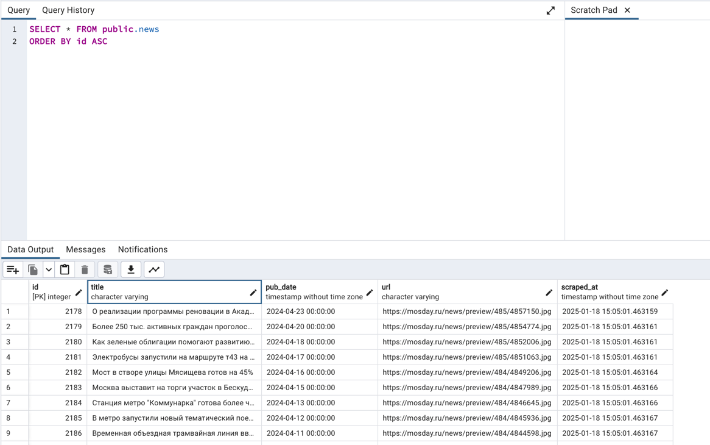

# Привет!

В этом README я расскажу о процессе создания проекта, его особенностях и способе запуска.

---

## **Описание проекта**

Этот проект представляет собой **парсер новостей** с сайта [Mosday](https://mosday.ru/news/tags.php?metro).  
Он собирает актуальные данные с **первой страницы новостей** и сохраняет их для последующего использования через **API**.

---

## **Проблемы, с которыми я столкнулся**

1. **Неясности в ТЗ:**
   - Не было указано, как обрабатывать данные: обновлять существующие записи или допускать дубликаты.
   - Решено очищать базу данных перед каждым новым парсингом.

2. **Структура HTML:**
   - Разметка сайта сложная, что затруднило извлечение данных. Данные лежат в одинаковых тегах с разными шрифтами.

3. **Ограничение заголовков:**
   - Заголовки пришлось ограничивать до **170 символов**, чтобы избежать попадания нерелевантных данных.

4. **Работа с датами:**
   - Даты и время разделены, поэтому использовались **регулярные выражения** для их объединения.

---

## **Ключевые особенности**

### **Парсинг и обновление данных:**
- Перед каждым новым парсингом база данных **очищается** для предотвращения дубликатов.
- Парсится **только первая страница** сайта, что гарантирует актуальность данных.

### **Работа с разметкой сайта:**
- HTML-разметка сайта специфична, из-за чего пришлось внедрить несколько решений:
  1. Ограничение длины заголовка новостей до **100 символов**, чтобы исключить нерелевантные записи.
  2. Объединение даты и времени публикации через **регулярные выражения**.

### **API для получения новостей за последние дни:**
- Реализован API-метод, который возвращает новости за последние `n` дней.
- Так как на сайте нет данных после **23 апреля 2024**, расчет дней производится относительно последней даты новостей.

---


## **Как запустить проект**

### Шаг 1: Настройка окружения
- Вметсе ссылкой на репозиторий приложу .env файл через который я запускал

### Шаг 2: Сборка и запуск
- Выполните следующие команды:

```bash
cd deploy
sudo docker compose up --build
```

Результат работы
